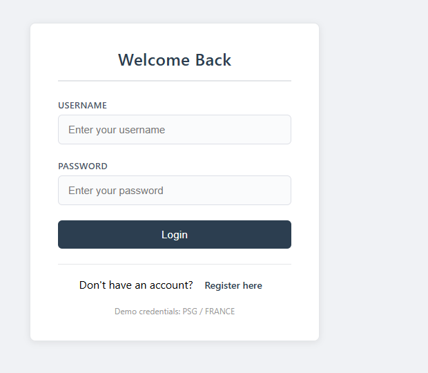
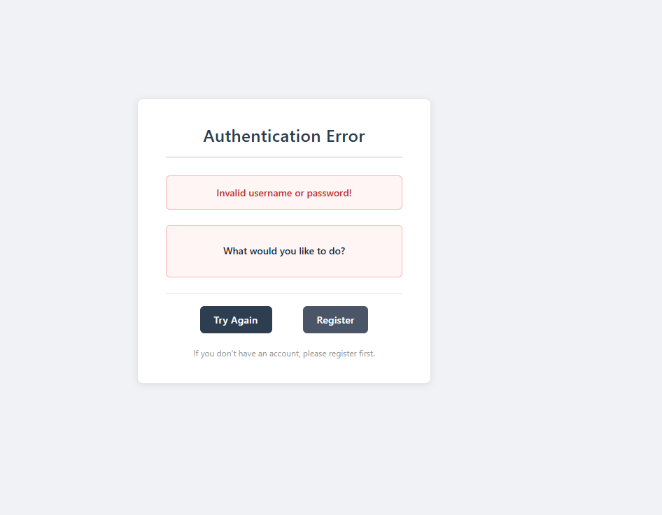
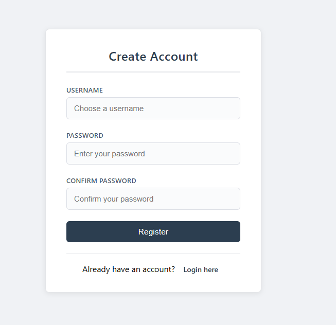

---
# Name: KOWO MANFOUO ELIE MAKODA
## class: Inge 3 ISI En 
#  KOWO Authentication System

##  Description

This project is a simple **user authentication web application** developed using **Jakarta Servlet and JSP**.

The system allows users to:

* ✅ Register a new account
* ✅ Login using registered credentials
* ✅ Validate user authentication with MySQL database

---

## 🛠 Technologies Used

* Java
* Jakarta Servlet
* JSP
* MySQL
* JDBC (`com.mysql.cj.jdbc.Driver`)
* Apache Tomcat 11
* Eclipse Dynamic Web Project

---

##  Project Structure

```
KOWOLoginProject
│
├── login.jsp
├── register.jsp
├── success.jsp
├── error.jsp
│
├── LoginServlet.java
└── RegisterServlet.java
```

---

## ⚙️ How It Works

### 🔹 Register

* User fills registration form
* `RegisterServlet` stores user data in MySQL database

### 🔹 Login

* User enters username and password
* `LoginServlet` checks credentials in database
* If valid → Redirect to success page
* If invalid → Redirect to error page

---

## 🚀 How to Run

1. Export the project as a **WAR file**
2. Copy it into:

   ```
   apache-tomcat-11/webapps/
   ```
3. Start Tomcat
4. Open in browser:

   ```
   http://localhost:8080/KOWOLoginProject/
   ```

---

## 👤 Author

Elie Makoda Kowo Manoufo

Java Web Development Assignment



